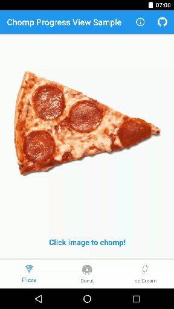

# Chomp Progress View 

A (semi) realistic chomping progress view that takes bites out of your delicious images! Nom! Nom!

* Increment progress.
* Change bite size.
* Select a bite direction or just take random(ish) bites.  
* (semi) realistic bites taken from images set in the view (use an image with a transparent background for best effect)

<p>
<a href="https://play.google.com/store/apps/details?id=uk.co.barbuzz.chompprogressview.sample"></a>
</p>
<p>

</p>
  
<!---->

### Setup
To use **ChompProgressView** in your projects, simply add the library as a dependency to your build.

##### Gradle
```
dependencies {
  compile 'uk.co.barbuzz:chompprogressview:0.0.1'
}
```

##### Maven
```
<dependency>
  <groupId>uk.co.barbuzz.chompprogressview</groupId>
  <artifactId>chompprogressview</artifactId>
  <version>0.0.1</version>
  <type>pom</type>
</dependency>
```

Alternatively you can directly import the /library project into your Android Studio project and add it as a dependency in your build.gradle.

The library is currently configured to be built via Gradle only. It doesn't have any dependencies. :-)

* Compiled SDK Version      - marshmallow-24
* Minimum SDK Version       - >= Gingerbread-10

### Usage
For more detailed code example to use the library, Please refer to the `/sample` app.

`ChompProgressView` can be added as a custom view to any layout.

```
<uk.co.barbuzz.chompprogressview.ChompProgressView
        android:id="@+id/chompProgressView"
        android:layout_width="match_parent"
        android:layout_height="match_parent"
        android:src="@drawable/pizza"
        app:biteRadius="200dp"
        app:chompProgress="0"
        app:chompMax="100"
        app:chompDirection="top"/>
```

You can then either set the xml parameters to configure the view or do it programmatically as follows.
```
ChompProgressView chompProgressView = (ChompProgressView) findViewById(R.id.chompProgressView);

chompProgressView.setImageDrawableChomp(mPizzaDrawble)
chompProgressView.setBiteRadius(400);
chompProgressView.setChompMax(100);
chompProgressView.setChompProgress(0);
```
**Remember to use the ```setImageDrawableChomp(Drawable)``` method instead of ```setImageDrawable(Drawable)``` as this stores the orginal drawable and calculates some bite information.**

The chomp direction can be changed between random bites and a specified direction as shown in the example below (```RANDOM``` is the default). This can also be set in the view attributes xml (see above).
```
mChompProgressImageView.setChompDirection(ChompProgressImageView.ChompDirection.TOP);
```

Bite radius can be set (400 is the default) in code as follows or in the view attributes xml (see above).
```
mChompProgressImageView.setBiteRadius(400);
```

You can also reset the image and progress/bites taken by calling the following method.
```
chompProgressView.removeBites();
```

### TODO
1. Improve the overall drawing of the bite
2. Make the takeBite() method of ChompProgressImageView more flexible with bite direction config

### Thanks

This library was made after a conversation while eating free pizza at the great <a href="https://www.meetup.com/swmobile/">SW Mobile Meetup</a> in Bristol UK.  Thanks for all the pizza inspiration! 

Also thanks to the <a href="https://thenounproject.com">noun project</a> for providing the pizza and lolly icons (Imogen Oh & Kristin McPeak respectively)

### Licence
```
Copyright (c) 2016 Andy Barber

Licensed under the Apache License, Version 2.0 (the "License");
you may not use this file except in compliance with the License.
You may obtain a copy of the License at

  http://www.apache.org/licenses/LICENSE-2.0

Unless required by applicable law or agreed to in writing, software
distributed under the License is distributed on an "AS IS" BASIS,
WITHOUT WARRANTIES OR CONDITIONS OF ANY KIND, either express or implied.
See the License for the specific language governing permissions and
limitations under the License.
```
